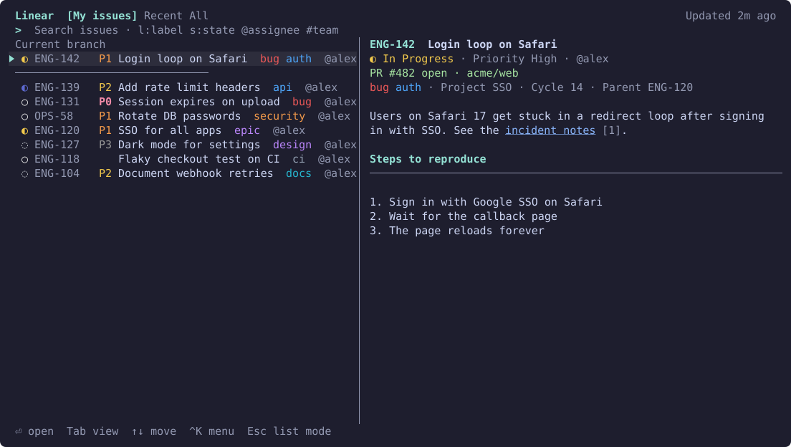
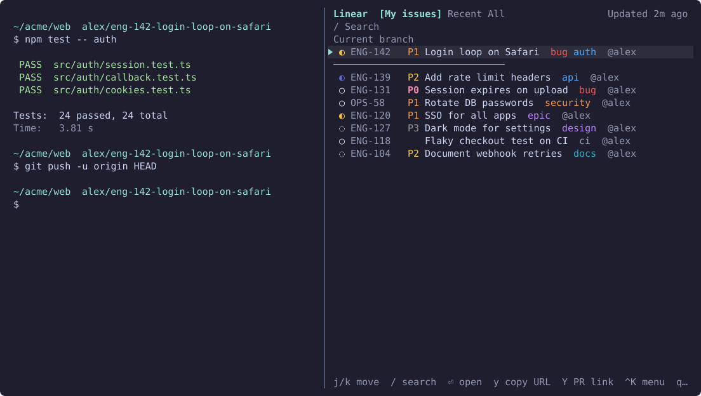
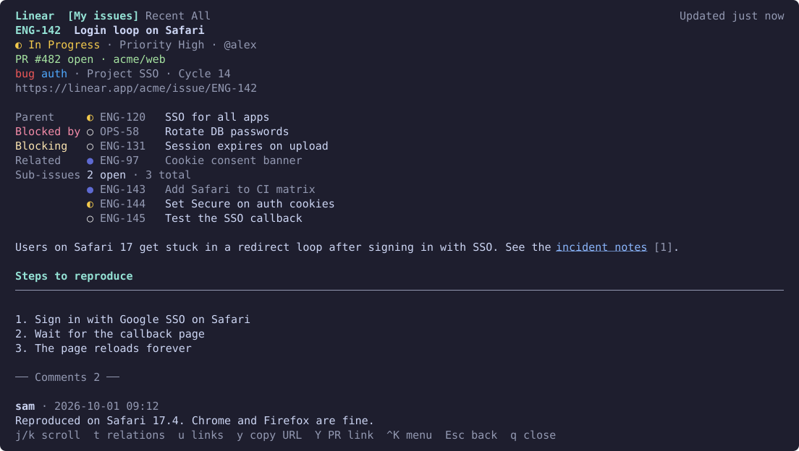

# herdr-linear

**Fast Linear issue lookup inside [herdr](https://herdr.dev).** A popup palette, or a side pane you keep open, that searches as you type, renders issue bodies and comments as markdown in the terminal, and copies issue and PR links.

English · [한국어](docs/README.ko.md) · [日本語](docs/README.ja.md) · [简体中文](docs/README.zh-CN.md) · [Deutsch](docs/README.de.md)

[Roadmap](ROADMAP.md) · MIT

## Screenshots







## Features

- **Tabs**: your open issues · recently viewed · all issues in your teams, drawn with Linear's own state and label colors.
- **Side pane**: a second key opens the same screen in a pane to the right of your work, and closes it again. It stays open and refreshes what you're looking at every 60 seconds by default. In list mode, Esc doesn't close it; `q` does.
- **Priority**: a label after the issue ID, most urgent first: red `P0` urgent, orange `P1` high, yellow `P2` medium, gray `P3` low. The search token `p:` still takes Linear's numbers or names (`p:1` or `p:urgent` is P0).
- **Search as you type**: cached issues are searched instantly. When you pause for 300 ms the server is searched too and the results are merged. Pick "⏎ Search on the server (includes comments)" at the bottom of the list to search comments as well.
- **Issue detail**: markdown body (headings, lists, code blocks, tables), comments, and a list of links. An open PR is shown at the top.
- **Relations**: the detail view lists the parent, sub-issues, blocked by, blocking, and related issues in Linear's state colors. Press `t` for the relations menu or click a line to open an issue, and Esc to come back.
- **Copy**: `y` copies the issue URL and `Y` copies the open PR link. Copying uses OSC 52, so it reaches your clipboard even when you attach to herdr remotely.
- **Current branch**: when the focused pane is on a branch like `me/eng-123-fix-login`, that issue is pinned at the top.
- **Links**: Ctrl+click a `linear.app/…/issue/…` link in herdr to open it in the palette. Open the palette with an issue ID selected to jump straight to that issue.
- **Mouse**: wheel to move and scroll, click to select, click the selected row again to open it. Whatever you can click lights up under the pointer.
- **Cache first**: issues you have seen are stored locally, shown instantly next time and refreshed in the background. They stay readable offline.
- **Languages**: English by default. Set `language` to switch the interface to Korean, Japanese, Simplified Chinese, or German (see Configuration).

## Requirements

- herdr 0.9.3 or later
- macOS (Apple Silicon or Intel) or Linux (x86_64 or arm64), with `bash` and `curl` (preinstalled on macOS and most Linux distributions)
- Rust 1.88 or later, only when no prebuilt binary can be used (another platform, or the download fails). The plugin is then built from source.

## Install

```sh
herdr plugin install jenthous/herdr-linear
```

On macOS and Linux this downloads a prebuilt binary from GitHub Releases and checks its SHA-256 checksum. If that isn't possible, it builds from source with Cargo.

Plugins can't register keys themselves. Add a binding to `~/.config/herdr/config.toml`:

```toml
[[keys.command]]
key = "prefix+i"
type = "plugin_action"
command = "jh.linear.palette"
description = "Linear search"

[[keys.command]]
key = "prefix+shift+i"
type = "plugin_action"
command = "jh.linear.side"
description = "Linear side pane"

# Optional: a direct key that also works while a non-Latin input method is active
[[keys.command]]
key = "ctrl+alt+i"
type = "plugin_action"
command = "jh.linear.palette"
description = "Linear search"
```

You can give `jh.linear.side` a direct key the same way. The actions also show up in the command-palette plugin.

## API key

Create a key in Linear → Settings → Security & access → Personal API keys. The first time you open the palette it asks for the key: paste it and press Enter. The key is checked against Linear and saved with mode 0600.

- `LINEAR_API_KEY` in the environment takes precedence.
- The key is only sent in the `Authorization` header. It is never written to logs, shown on screen, or included in error messages.

## Keys

| Mode | Keys |
|---|---|
| Search (default) | type to search, ↑/↓ or Ctrl+P/N to move, Enter to open, Tab/Shift+Tab to switch tabs, Ctrl+K for the action menu, Esc for list mode |
| List | j/k to move, g/G for top/bottom, `/` to search, Enter to open, `y` copy issue URL, `Y` copy open PR link, `r` refresh, `o` open in browser, `q`/Esc to close (Esc doesn't close the side pane) |
| Detail | j/k to scroll, Ctrl+D/U for half a page, g/G for top/bottom, `t` for relations, `u` for links, `y` `Y` `o` `r`, Esc to go back, `q` to close |

- Copy the issue ID from the Ctrl+K menu. URL copy is at the top of that menu.
- Ctrl combinations work with any input method. In list and detail modes, Korean jamo keys act as the same Latin keys (ㅓ→j, ㅏ→k, …).
- With mouse support on, drag-selecting text inside the palette needs Shift (or Option, depending on your terminal).
- When you attach to herdr remotely, `o` opens a browser on the machine that runs herdr.

## Search syntax

Mix free text and tokens. All conditions must match. Quote values that contain spaces: `s:"In Progress"`.

| Token | Meaning | Example |
|---|---|---|
| `s:value` | state name or type (`started`, `todo`, `done`, …) | `s:started` |
| `l:value` | label | `l:bug` |
| `@value` | assignee (`@me` is you) | `@minsu` |
| `#KEY` | team | `#ENG` |
| `p:value` | priority (`urgent`/`1` … `none`/`0`) | `p:high` |

## Configuration

`~/.config/herdr/plugins/config/jh.linear/config.toml`. Every key is optional.

```toml
language = "en"          # interface language: en, ko, ja, zh-CN, de (default: en)
teams = ["ENG", "OPS"]   # scope for search and the "All" tab; empty means all your teams

[side]
refresh_seconds = 60     # how often the side pane refreshes (0 to 3600 seconds); 0 turns it off

[cache]
retention_days = 30      # issues not fetched or viewed for this long are dropped from the cache
```

The language applies the next time the palette, side pane, or CLI starts. Keep `language` on the first lines, above any `[section]`: TOML puts a key below a `[section]` header into that section, where it is ignored. Region tags such as `de-DE` or `ja_JP` also work. The standalone CLI reads its own file, `~/.config/herdr-linear/config.toml`; set `language` there as well if you use both. Action names in herdr's command palette come from the plugin manifest and stay in English.

## Files

| File | Location |
|---|---|
| `config.toml`, `credentials` | `~/.config/herdr/plugins/config/jh.linear/` |
| `cache.db`, `herdr-linear.log`, `side-panes.json` | `~/.local/state/herdr/plugins/jh.linear/` |

The standalone CLI uses `~/.config/herdr-linear/` and `~/.local/state/herdr-linear/`. Each side also finds a key saved by the other.

## CLI

The same binary works on its own:

```sh
herdr-linear login | logout | whoami
herdr-linear mine
herdr-linear search login l:bug @me
herdr-linear search --deep session expired
herdr-linear show ENG-123
```

## Troubleshooting

- **The palette doesn't open**: herdr refuses popups while its settings, copy mode, or another modal is open. Close it and try again.
- **The side pane doesn't open or close**: the reason shows in a herdr notification and in `herdr-linear.log`. If the side pane was closed some other way, the key opens a new one.
- **"Offline"**: cached data is shown. It retries on the next lookup.
- **"Linear API rate limit reached"**: a short notice at the bottom says when to try again. Automatic server search waits until then; local search keeps working.
- Errors are written to `herdr-linear.log`.

## Development

```sh
cargo test
cargo clippy --all-targets -- -D warnings
scripts/deploy-local.sh   # build and link a stable copy for daily use on this machine
```

`scripts/deploy-local.sh` copies the built plugin to `~/.local/share/herdr-linear/plugin`, links it into herdr, and links the `herdr-linear` command into `~/.local/bin`. After that, working in the repository doesn't change the plugin you use every day.

To regenerate the screenshots, run `cargo run --example screenshots`. They are drawn from fake data and written to `docs/images/<language>/`.

To release, bump `version` in `Cargo.toml` and `herdr-plugin.toml`, run `cargo test` so Cargo updates `Cargo.lock`, commit, and push the tag `vX.Y.Z` first. When the release workflow has attached the binaries and checksums, push `main`.

## License

MIT. See [LICENSE](LICENSE).
