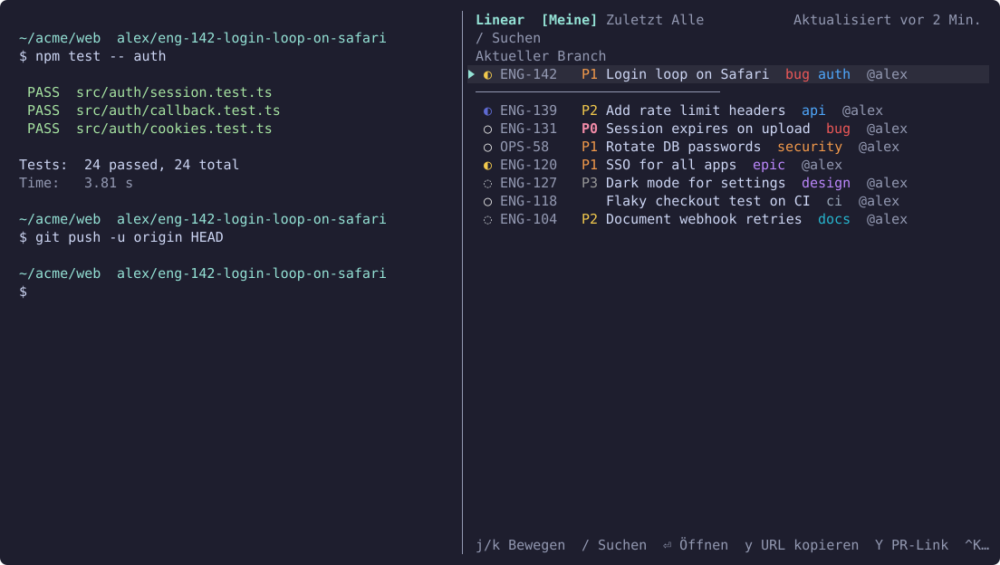
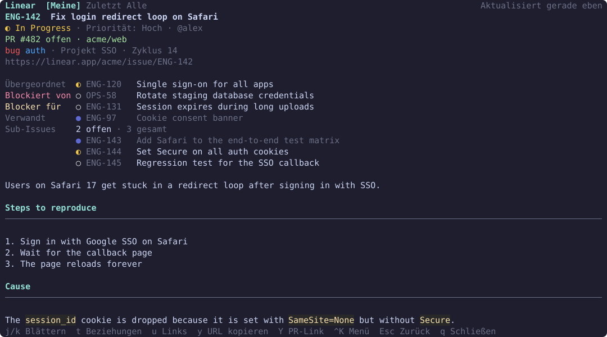

# herdr-linear

**Linear-Issues in [herdr](https://herdr.dev) schnell nachschlagen.** Eine Popup-Palette oder ein Seitenbereich, der geöffnet bleibt: Die Suche läuft schon während der Eingabe, Beschreibungen und Kommentare erscheinen im Terminal als Markdown, und Links zu Issues und PRs lassen sich kopieren.

[English](../README.md) · [한국어](README.ko.md) · [日本語](README.ja.md) · [简体中文](README.zh-CN.md) · Deutsch

[Roadmap](../ROADMAP.md) · MIT

> Diese README ist eine Übersetzung der englischen Fassung. Bei Abweichungen gilt die englische README.

## Screenshots






## Funktionen

- **Tabs**: eigene offene Issues · zuletzt angesehen · alle Issues der eigenen Teams, dargestellt in den Status- und Label-Farben von Linear.
- **Seitenbereich**: Mit einer zweiten Taste öffnet sich dieselbe Ansicht rechts neben der Arbeit in einem eigenen Bereich; dieselbe Taste schließt ihn wieder. Der Bereich bleibt offen und aktualisiert das gerade Angezeigte standardmäßig alle 60 Sekunden. Im Listenmodus schließt Esc ihn nicht, `q` schon.
- **Priorität**: ein Label hinter der Issue-ID, dringendste zuerst: rot `P0` dringend, orange `P1` hoch, gelb `P2` mittel, grau `P3` niedrig. Das Such-Token `p:` nimmt weiterhin Linears Zahlen oder Namen (`p:1` oder `p:urgent` ist P0).
- **Suche während der Eingabe**: Zwischengespeicherte Issues werden sofort durchsucht. Nach 300 ms Pause wird auch der Server durchsucht und die Ergebnisse werden zusammengeführt. Der Eintrag „⏎ Auf dem Server suchen (mit Kommentaren)“ am Ende der Liste durchsucht auch die Kommentare.
- **Issue-Details**: Markdown-Beschreibung (Überschriften, Listen, Codeblöcke, Tabellen), Kommentare und eine Linkliste. Ein offener PR steht ganz oben.
- **Beziehungen**: Die Detailansicht zeigt die Beziehungen eines Issues in den Statusfarben von Linear: Übergeordnet, Sub-Issues, Blockiert von, Blocker für und Verwandt. Mit `t` öffnet sich das Beziehungsmenü; ein Klick auf eine Zeile öffnet das Issue, mit Esc geht es zurück.
- **Kopieren**: `y` kopiert die Issue-URL, `Y` den Link zum offenen PR. Kopiert wird per OSC 52, daher landet der Inhalt auch bei einer Remote-Verbindung zu herdr in der lokalen Zwischenablage.
- **Aktueller Branch**: Steht der fokussierte Bereich auf einem Branch wie `me/eng-123-fix-login`, wird das zugehörige Issue oben angeheftet.
- **Links**: Ctrl+Klick auf einen Link `linear.app/…/issue/…` in herdr öffnet ihn in der Palette. Wird die Palette bei markierter Issue-ID geöffnet, springt sie direkt zu diesem Issue.
- **Maus**: Mit dem Mausrad bewegen und scrollen, per Klick auswählen, die ausgewählte Zeile erneut anklicken zum Öffnen. Alles Anklickbare leuchtet unter dem Mauszeiger auf.
- **Cache zuerst**: Bereits angesehene Issues werden lokal gespeichert, beim nächsten Mal sofort angezeigt und im Hintergrund aktualisiert. Offline bleiben sie lesbar.
- **Sprachen**: Standardmäßig Englisch. Mit `language` lässt sich die Oberfläche auf Koreanisch, Japanisch, Chinesisch (vereinfacht) oder Deutsch umstellen (siehe Konfiguration).

## Voraussetzungen

- herdr 0.9.3 oder neuer
- macOS (Apple Silicon oder Intel) oder Linux (x86_64 oder arm64) mit `bash` und `curl` (unter macOS und den meisten Linux-Distributionen vorinstalliert)
- Rust 1.88 oder neuer, nur wenn kein vorkompiliertes Binary verwendet werden kann (andere Plattform oder fehlgeschlagener Download). Das Plugin wird dann aus dem Quellcode gebaut.

## Installation

```sh
herdr plugin install jenthous/herdr-linear
```

Unter macOS und Linux wird ein vorkompiliertes Binary von GitHub Releases geladen und seine SHA-256-Prüfsumme geprüft. Ist das nicht möglich, wird mit Cargo aus dem Quellcode gebaut.

Plugins können keine Tasten selbst registrieren. Eine Belegung in `~/.config/herdr/config.toml` ergänzen:

```toml
[[keys.command]]
key = "prefix+i"
type = "plugin_action"
command = "jh.linear.palette"
description = "Linear search"

[[keys.command]]
key = "prefix+shift+i"
type = "plugin_action"
command = "jh.linear.side"
description = "Linear side pane"

# Optional: eine direkte Taste, die auch bei aktiver nicht-lateinischer Eingabemethode funktioniert
[[keys.command]]
key = "ctrl+alt+i"
type = "plugin_action"
command = "jh.linear.palette"
description = "Linear search"
```

`jh.linear.side` kann auf dieselbe Weise eine direkte Taste bekommen. Die Aktionen erscheinen auch im Plugin command-palette.

## API-Schlüssel

Einen Schlüssel in Linear → Settings → Security & access → Personal API keys erstellen. Beim ersten Öffnen der Palette wird der Schlüssel abgefragt: einfügen und Enter drücken. Der Schlüssel wird bei Linear geprüft und mit den Rechten 0600 gespeichert.

- `LINEAR_API_KEY` in der Umgebung hat Vorrang.
- Der Schlüssel wird nur im `Authorization`-Header gesendet. Er wird nie in Logs geschrieben, auf dem Bildschirm angezeigt oder in Fehlermeldungen aufgenommen.

## Tasten

| Modus | Tasten |
|---|---|
| Suche (Standard) | Eingabe zum Suchen, ↑/↓ oder Ctrl+P/N zum Bewegen, Enter zum Öffnen, Tab/Shift+Tab zum Wechseln der Tabs, Ctrl+K für das Aktionsmenü, Esc für den Listenmodus |
| Liste | j/k zum Bewegen, g/G für Anfang/Ende, `/` zum Suchen, Enter zum Öffnen, `y` Issue-URL kopieren, `Y` Link zum offenen PR kopieren, `r` aktualisieren, `o` im Browser öffnen, `q`/Esc zum Schließen (Esc schließt den Seitenbereich nicht) |
| Details | j/k zum Scrollen, Ctrl+D/U für eine halbe Seite, g/G für Anfang/Ende, `t` für Beziehungen, `u` für Links, `y` `Y` `o` `r`, Esc zum Zurückgehen, `q` zum Schließen |

- Die Issue-ID lässt sich im Ctrl+K-Menü kopieren. Das Kopieren der URL steht ganz oben in diesem Menü.
- Ctrl-Kombinationen funktionieren mit jeder Eingabemethode. Im Listen- und Detailmodus wirken koreanische Jamo-Tasten wie die entsprechenden lateinischen Tasten (ㅓ→j, ㅏ→k, …).
- Bei aktiver Mausunterstützung braucht das Markieren von Text per Ziehen in der Palette Shift (je nach Terminal Option).
- Bei einer Remote-Verbindung zu herdr öffnet `o` einen Browser auf dem Rechner, auf dem herdr läuft.

## Suchsyntax

Freitext und Token lassen sich mischen. Alle Bedingungen müssen zutreffen. Werte mit Leerzeichen in Anführungszeichen setzen: `s:"In Progress"`.

| Token | Bedeutung | Beispiel |
|---|---|---|
| `s:Wert` | Statusname oder -typ (`started`, `todo`, `done`, …) | `s:started` |
| `l:Wert` | Label | `l:bug` |
| `@Wert` | zugewiesene Person (`@me` steht für das eigene Konto) | `@minsu` |
| `#KEY` | Team | `#ENG` |
| `p:Wert` | Priorität (`urgent`/`1` … `none`/`0`) | `p:high` |

## Konfiguration

`~/.config/herdr/plugins/config/jh.linear/config.toml`. Alle Einträge sind optional.

```toml
language = "de"          # Sprache der Oberfläche: en, ko, ja, zh-CN, de (Standard: en)
teams = ["ENG", "OPS"]   # Teams für die Suche und den Tab „Alle“; leer bedeutet alle eigenen Teams

[side]
refresh_seconds = 60     # wie oft der Seitenbereich aktualisiert wird (0 bis 3600 Sekunden); 0 schaltet die Aktualisierung ab

[cache]
retention_days = 30      # Issues, die so lange weder geladen noch angesehen wurden, werden aus dem Cache entfernt
```

Die Sprache gilt ab dem nächsten Start der Palette, des Seitenbereichs oder der CLI. Auch Regionskennungen wie `de-DE` oder `ja_JP` funktionieren. Die eigenständige CLI liest eine eigene Datei, `~/.config/herdr-linear/config.toml`; bei Nutzung beider `language` auch dort setzen.

## Dateien

| Datei | Ort |
|---|---|
| `config.toml`, `credentials` | `~/.config/herdr/plugins/config/jh.linear/` |
| `cache.db`, `herdr-linear.log`, `side-panes.json` | `~/.local/state/herdr/plugins/jh.linear/` |

Die eigenständige CLI verwendet `~/.config/herdr-linear/` und `~/.local/state/herdr-linear/`. Ein von der jeweils anderen Seite gespeicherter Schlüssel wird ebenfalls gefunden.

## CLI

Dasselbe Binary lässt sich auch eigenständig nutzen:

```sh
herdr-linear login | logout | whoami
herdr-linear mine
herdr-linear search login l:bug @me
herdr-linear search --deep session expired
herdr-linear show ENG-123
```

## Fehlerbehebung

- **Die Palette öffnet sich nicht**: herdr lehnt Popups ab, solange Einstellungen, der Kopiermodus oder ein anderes modales Fenster geöffnet sind. Schließen und erneut versuchen.
- **Der Seitenbereich lässt sich nicht öffnen oder schließen**: Der Grund erscheint in einer herdr-Benachrichtigung und in `herdr-linear.log`. Wurde der Seitenbereich auf andere Weise geschlossen, öffnet die Taste einen neuen.
- **„Offline“**: Zwischengespeicherte Daten werden angezeigt. Beim nächsten Abruf wird es erneut versucht.
- **„Linear-API-Limit erreicht“**: Ein kurzer Hinweis am unteren Rand nennt den Zeitpunkt für den nächsten Versuch. Bis dahin pausiert die automatische Serversuche; die lokale Suche funktioniert weiter.
- Fehler werden in `herdr-linear.log` geschrieben.

## Entwicklung

```sh
cargo test
cargo clippy --all-targets -- -D warnings
scripts/deploy-local.sh   # eine stabile Kopie für den täglichen Gebrauch auf diesem Rechner bauen und verlinken
```

`scripts/deploy-local.sh` kopiert das gebaute Plugin nach `~/.local/share/herdr-linear/plugin`, verlinkt es in herdr und verlinkt den Befehl `herdr-linear` nach `~/.local/bin`. Danach ändert die Arbeit im Repository das täglich genutzte Plugin nicht mehr.

Zum Neuerzeugen der Screenshots `cargo run --example screenshots` ausführen. Die Bilder werden aus Testdaten gezeichnet und in `docs/images/<language>/` geschrieben.

Für ein Release `version` in `Cargo.toml` und `herdr-plugin.toml` erhöhen, `cargo test` ausführen, damit Cargo `Cargo.lock` aktualisiert, committen und zuerst den Tag `vX.Y.Z` pushen. Sobald der Release-Workflow die Binaries und Prüfsummen angehängt hat, `main` pushen.

## Lizenz

MIT. Siehe [LICENSE](../LICENSE).
