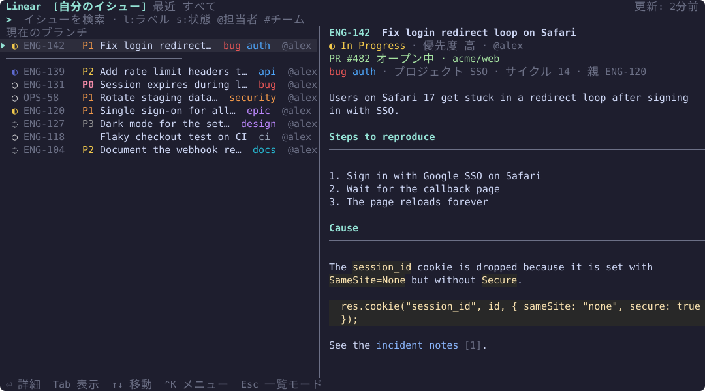
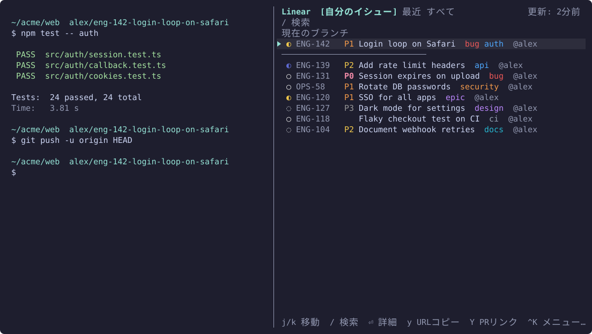
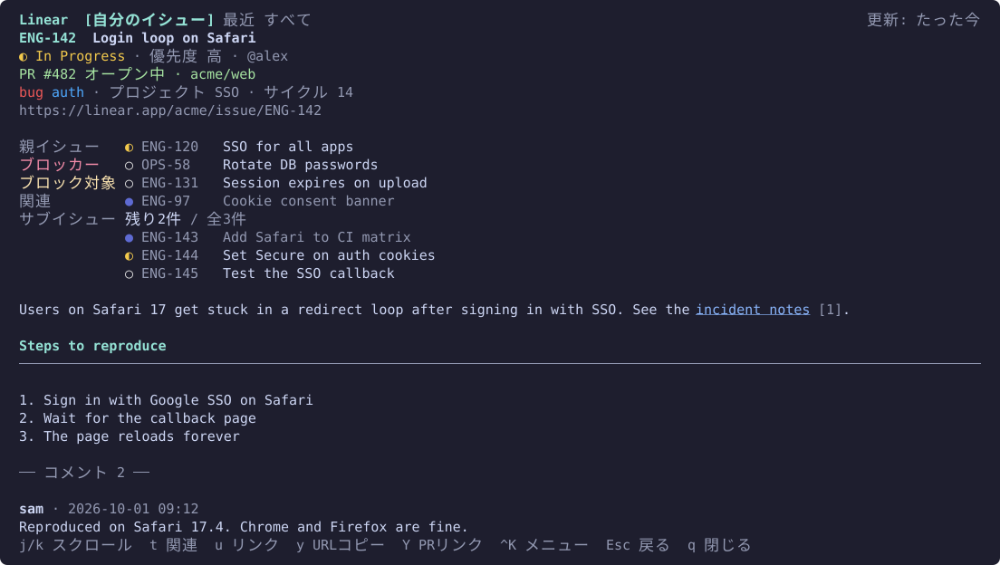

# herdr-linear

**[herdr](https://herdr.dev)の中でLinearのイシューをすばやく調べられます。** ポップアップのパレット、または開いたままにしておけるサイドペインで、入力しながら検索でき、イシューの本文とコメントをターミナル上でMarkdownとして表示でき、イシューやPRのリンクをコピーできます。

[English](../README.md) · [한국어](README.ko.md) · 日本語 · [简体中文](README.zh-CN.md) · [Deutsch](README.de.md)

[ロードマップ](../ROADMAP.md) · MIT

> この README は英語版の翻訳です。内容が異なる場合は英語版に従ってください。

## スクリーンショット







## 機能

- **タブ**: 自分の未完了イシュー · 最近見たイシュー · 所属チームのすべてのイシュー。状態とラベルは、Linearで設定されている色で表示します。
- **サイドペイン**: 2つ目のキーで、同じ画面を作業中のペインの右側に開き、もう一度押すと閉じます。開いたままにでき、表示中の内容をデフォルトで60秒ごとに更新します。一覧モードではEscで閉じず、`q`で閉じます。
- **優先度**: イシューIDの後ろに優先度のラベルを表示します。緊急度の高い順に、赤の`P0`が緊急、オレンジの`P1`が高、黄色の`P2`が中、灰色の`P3`が低です。検索トークン`p:`は、これまでどおりLinearの番号または名前を受け付けます (`p:1`や`p:urgent`がP0)。
- **入力しながら検索**: キャッシュ済みのイシューは即座に検索します。入力を300ミリ秒止めるとサーバーも検索し、結果を統合します。一覧の末尾にある「⏎ サーバーで検索 (コメントを含む)」を選ぶと、コメントも検索できます。
- **イシュー詳細**: Markdownの本文 (見出し、リスト、コードブロック、表)、コメント、リンクの一覧を表示します。オープン中のPRは先頭に表示されます。
- **関連イシュー**: 詳細画面に、親イシュー、サブイシュー、ブロッカー、ブロック対象、関連するイシューをLinearの状態の色で表示します。`t`で関連イシューのメニューを開くか、行をクリックするとそのイシューを開けます。Escで戻ります。
- **コピー**: `y`でイシューのURL、`Y`でオープン中のPRのリンクをコピーします。コピーにはOSC 52を使うため、herdrにリモートで接続していても手元のクリップボードに届きます。
- **現在のブランチ**: フォーカス中のペインが`me/eng-123-fix-login`のようなブランチにいるとき、そのイシューを先頭に固定します。
- **リンク**: herdrで`linear.app/…/issue/…`のリンクをCtrl+クリックすると、パレットで開きます。イシューIDを選択した状態でパレットを開くと、そのイシューへ直接移動します。
- **マウス**: ホイールで移動とスクロール、クリックで選択、選択済みの行をもう一度クリックすると開きます。クリックできる場所は、ポインタを乗せると明るくなります。
- **キャッシュ優先**: 一度見たイシューはローカルに保存し、次回は即座に表示してバックグラウンドで更新します。オフラインでも読めます。
- **言語**: デフォルトは英語です。`language`を設定すると、画面を韓国語、日本語、簡体字中国語、ドイツ語に切り替えられます (「設定」を参照)。

## 動作環境

- herdr 0.9.3以降
- macOS (Apple SiliconまたはIntel) またはLinux (x86_64またはarm64)。`bash`と`curl`が必要です (macOSとほとんどのLinuxディストリビューションにはプリインストールされています)
- Rust 1.88以降。ビルド済みバイナリを使えない場合 (別のプラットフォーム、またはダウンロードに失敗した場合) にのみ必要です。その場合、プラグインはソースからビルドされます。

## インストール

```sh
herdr plugin install jenthous/herdr-linear
```

macOSとLinuxでは、GitHub Releasesからビルド済みバイナリをダウンロードし、SHA-256チェックサムを検証します。それができない場合は、Cargoでソースからビルドします。

プラグインは自分でキーを登録できないため、`~/.config/herdr/config.toml`にキーバインドを追加します。

```toml
[[keys.command]]
key = "prefix+i"
type = "plugin_action"
command = "jh.linear.palette"
description = "Linear search"

[[keys.command]]
key = "prefix+shift+i"
type = "plugin_action"
command = "jh.linear.side"
description = "Linear side pane"

# 任意: ラテン文字以外の入力方式が有効なときも使える直接キー
[[keys.command]]
key = "ctrl+alt+i"
type = "plugin_action"
command = "jh.linear.palette"
description = "Linear search"
```

`jh.linear.side`にも、同じ方法で直接キーを割り当てられます。アクションはcommand-paletteプラグインにも表示されます。

## APIキー

LinearのSettings → Security & access → Personal API keysでキーを作成します。パレットを初めて開くとキーの入力を求められるので、貼り付けてEnterを押します。キーはLinearで検証され、パーミッション0600で保存されます。

- 環境変数`LINEAR_API_KEY`がある場合は、それが優先されます。
- キーは`Authorization`ヘッダーでのみ送信されます。ログへの書き込み、画面への表示、エラーメッセージへの記載は行いません。

## キー操作

| モード | キー |
|---|---|
| 検索 (デフォルト) | 入力で検索、↑/↓またはCtrl+P/Nで移動、Enterで開く、Tab/Shift+Tabでタブ切り替え、Ctrl+Kでアクションメニュー、Escで一覧モード |
| 一覧 | j/kで移動、g/Gで先頭/末尾、`/`で検索、Enterで開く、`y`でイシューのURLをコピー、`Y`でオープン中のPRリンクをコピー、`r`で再読み込み、`o`でブラウザを開く、`q`/Escで閉じる (サイドペインはEscでは閉じません) |
| 詳細 | j/kでスクロール、Ctrl+D/Uで半ページ移動、g/Gで先頭/末尾、`t`で関連イシュー、`u`でリンク、`y` `Y` `o` `r`、Escで戻る、`q`で閉じる |

- イシューIDのコピーはCtrl+Kメニューにあります。URLのコピーはそのメニューの先頭です。
- Ctrl系の組み合わせは、どの入力方式でも動作します。一覧モードと詳細モードでは、韓国語のジャモキーが対応するラテン文字キーとして扱われます (ㅓ→j、ㅏ→k、…)。
- マウス操作を有効にしている間、パレット内のテキストをドラッグで選択するには、Shift (ターミナルによってはOption) を押しながら操作します。
- herdrにリモートで接続している場合、`o`はherdrが動いているマシンでブラウザを開きます。

## 検索構文

キーワードとトークンを組み合わせられます。すべての条件に一致する必要があります。空白を含む値は引用符で囲みます (`s:"In Progress"`)。

| トークン | 意味 | 例 |
|---|---|---|
| `s:値` | 状態名または種類 (`started`、`todo`、`done` など) | `s:started` |
| `l:値` | ラベル | `l:bug` |
| `@値` | 担当者 (`@me`は自分) | `@minsu` |
| `#KEY` | チーム | `#ENG` |
| `p:値` | 優先度 (`urgent`/`1` … `none`/`0`) | `p:high` |

## 設定

`~/.config/herdr/plugins/config/jh.linear/config.toml`。すべての項目は省略できます。

```toml
language = "ja"          # 画面の言語: en, ko, ja, zh-CN, de (デフォルト: en)
teams = ["ENG", "OPS"]   # 検索と「すべて」タブの対象。空の場合は所属するすべてのチーム

[side]
refresh_seconds = 60     # サイドペインの更新間隔 (0〜3600秒)。0で無効

[cache]
retention_days = 30      # この日数のあいだ取得も表示もされなかったイシューは、キャッシュから削除されます
```

言語は、次にパレット、サイドペイン、CLIを起動したときから反映されます。`language`はファイルの先頭、どの`[section]`よりも前に書いてください (TOMLでは`[section]`より後ろのキーはそのセクションの項目として扱われ、反映されません)。`de-DE`や`ja_JP`のような地域タグも使えます。単独で使うCLIは別のファイル`~/.config/herdr-linear/config.toml`を読むため、両方を使う場合はそちらにも`language`を設定してください。herdrのコマンドパレットに表示されるアクション名は、プラグインのマニフェストに由来するため、英語のままです。

## ファイル

| ファイル | 場所 |
|---|---|
| `config.toml`、`credentials` | `~/.config/herdr/plugins/config/jh.linear/` |
| `cache.db`、`herdr-linear.log`、`side-panes.json` | `~/.local/state/herdr/plugins/jh.linear/` |

単独で使うCLIは`~/.config/herdr-linear/`と`~/.local/state/herdr-linear/`を使います。どちらの側で保存したキーも、もう一方から見つけられます。

## CLI

同じバイナリを単体でも使えます:

```sh
herdr-linear login | logout | whoami
herdr-linear mine
herdr-linear search login l:bug @me
herdr-linear search --deep session expired
herdr-linear show ENG-123
```

## トラブルシューティング

- **パレットが開かない**: herdrは、設定画面やコピーモード、ほかのモーダルが開いている間はポップアップを開けません。閉じてからもう一度お試しください。
- **サイドペインを開閉できない**: 理由はherdrの通知と`herdr-linear.log`に表示されます。サイドペインがほかの方法で閉じられていた場合は、キーを押すと新しく開きます。
- **「オフライン」**: キャッシュ済みのデータを表示します。次に検索したときに再試行します。
- **「Linear APIのレート制限に達しました」**: 画面の下部に短い通知が表示され、いつ再試行できるかを知らせます。それまで自動のサーバー検索は待機し、ローカル検索は引き続き使えます。
- エラーは`herdr-linear.log`に書き込まれます。

## 開発

```sh
cargo test
cargo clippy --all-targets -- -D warnings
scripts/deploy-local.sh   # このマシンで日常的に使う安定したコピーをビルドしてリンク
```

`scripts/deploy-local.sh`は、ビルドしたプラグインを`~/.local/share/herdr-linear/plugin`にコピーしてherdrにリンクし、`herdr-linear`コマンドを`~/.local/bin`にリンクします。以降、リポジトリで作業しても、日常的に使っているプラグインは変わりません。

スクリーンショットを再生成するには、`cargo run --example screenshots`を実行します。ダミーデータで描画し、`docs/images/<language>/`に書き出します。

リリースするには、`Cargo.toml`と`herdr-plugin.toml`の`version`を上げ、`cargo test`を実行して`Cargo.lock`を更新させ、コミットし、先にタグ`vX.Y.Z`をプッシュします。リリースのワークフローがバイナリとチェックサムを添付したら、`main`をプッシュします。

## ライセンス

MIT。[LICENSE](../LICENSE)を参照してください。
