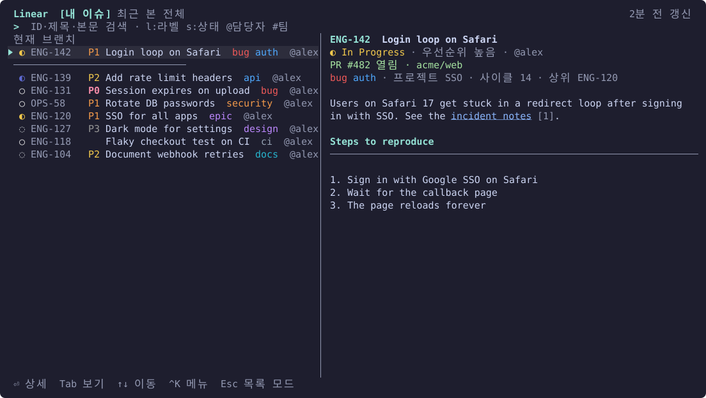
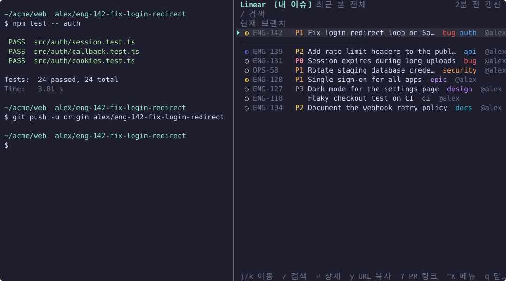
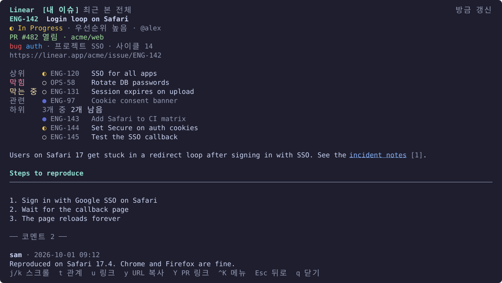

# herdr-linear

**[herdr](https://herdr.dev) 안에서 Linear 이슈를 빠르게 찾고 읽어요.** 팝업 팔레트를 띄우거나 사이드 pane에 상시로 띄워 두고, 입력하는 대로 찾고, 이슈 본문(markdown)과 코멘트를 터미널에서 바로 봐요. 이슈와 PR 링크도 복사해요.

[English](../README.md) · 한국어 · [日本語](README.ja.md) · [简体中文](README.zh-CN.md) · [Deutsch](README.de.md)

[로드맵](../ROADMAP.md#로드맵) · MIT

> 영어 README가 기준이에요. 내용이 다르면 영어를 따라요.
>
> 화면 기본 언어가 영어로 바뀌었어요. 한국어 화면을 계속 쓰려면 설정에 `language = "ko"`를 두세요. [설정](#설정)을 보세요.

## 스크린샷







## 기능

- **탭**: 내 이슈 · 최근 본 · 전체. 상태와 라벨은 Linear에 설정된 색으로 보여요.
- **사이드 pane**: 키를 하나 더 두면 같은 화면을 작업 오른쪽 pane에 열고 닫아요. 상시로 띄워 두고, 보고 있는 것을 기본 60초마다 새로 받아요. 목록 모드에서는 Esc로 닫히지 않고 `q`로 닫아요.
- **우선순위**: 목록 줄의 식별자 뒤에 급한 순서로 라벨을 붙여요. 빨간 `P0` 긴급, 주황 `P1` 높음, 노랑 `P2` 보통, 회색 `P3` 낮음이에요. 검색어 `p:`는 지금처럼 Linear 번호나 이름을 받아요(`p:1`, `p:긴급`이 P0).
- **입력하는 대로 검색**: 캐시에서 바로 찾아요. 입력이 0.3초 멈추면 서버에서도 찾아 합쳐요. 목록 맨 아래 "⏎ 서버에서 검색 (코멘트 포함)"을 고르면 코멘트까지 찾아요.
- **상세**: markdown 본문(제목, 목록, 코드 블록, 표), 코멘트, 링크 목록을 보여 줘요. 열린 PR은 맨 위에 보여요.
- **관계**: 상세에 상위·하위·막힘·막는 중·관련 이슈를 Linear 상태 색으로 보여 줘요. `t`로 관계 메뉴를 열거나 줄을 클릭하면 그 이슈로 가고, Esc로 돌아와요.
- **복사**: `y`는 이슈 URL, `Y`는 열린 PR 링크를 복사해요. OSC 52로 복사해서 herdr에 원격으로 붙어 있어도 지금 쓰는 컴퓨터의 클립보드로 와요.
- **현재 브랜치**: 지금 pane의 브랜치(`me/eng-123-...`)에 연결된 이슈를 맨 위에 고정해요.
- **링크**: herdr에서 linear.app 이슈 링크를 Ctrl+클릭하면 팔레트에서 열려요. 이슈 식별자(`ENG-123`)를 선택한 채로 열면 그 이슈로 바로 가요.
- **마우스**: 휠로 이동·스크롤하고, 줄을 클릭해 고르고, 고른 줄을 다시 클릭해 열어요. 누를 수 있는 곳에 마우스를 올리면 옅게 밝아져요.
- **캐시 먼저**: 한 번 본 내용은 저장해 두었다가 다음에 바로 보여 주고 뒤에서 새로 받아요. 오프라인에서도 볼 수 있어요.
- **언어**: 기본은 영어예요. `language`를 설정하면 화면을 한국어, 일본어, 중국어(간체), 독일어로 바꿀 수 있어요([설정](#설정) 참고).

## 필요한 것

- herdr 0.9.3 이상
- macOS(Apple Silicon·Intel) 또는 Linux(x86_64·arm64), 그리고 `bash`·`curl`(macOS와 대부분의 Linux에 기본으로 있어요)
- Rust 1.88 이상은 미리 빌드한 바이너리를 쓸 수 없을 때만 필요해요(다른 플랫폼이거나 받기에 실패할 때). 그때는 소스로 빌드해요.

## 설치

```sh
herdr plugin install jenthous/herdr-linear
```

macOS·Linux에서는 GitHub Releases에서 미리 빌드한 바이너리를 받아 SHA-256 체크섬을 확인해요. 그게 안 되면 Cargo로 소스를 빌드해요.

플러그인은 키를 직접 등록할 수 없어서 `~/.config/herdr/config.toml`에 추가해요.

```toml
[[keys.command]]
key = "prefix+i"
type = "plugin_action"
command = "jh.linear.palette"
description = "Linear 검색"

[[keys.command]]
key = "prefix+shift+i"
type = "plugin_action"
command = "jh.linear.side"
description = "Linear 사이드 pane"

# 한글 입력 중에도 바로 쓰는 키 (선택)
[[keys.command]]
key = "ctrl+alt+i"
type = "plugin_action"
command = "jh.linear.palette"
description = "Linear 검색"
```

`jh.linear.side`에도 같은 방법으로 직접 키를 둘 수 있어요. 액션은 command-palette 플러그인에도 나타나요.

## API 키

Linear → Settings → Security & access → Personal API keys에서 키를 만들어요. 팔레트를 처음 열면 키 입력 화면이 나와요. 붙여넣고 Enter를 누르면 Linear로 확인한 뒤 권한 0600으로 저장해요.

- `LINEAR_API_KEY` 환경 변수가 있으면 그 키를 먼저 써요.
- 키는 `Authorization` 헤더에만 써요. 로그, 화면, 오류 메시지에는 남기지 않아요.

## 키

| 모드 | 키 |
|---|---|
| 검색 (기본) | 글자 = 검색어, ↑/↓·Ctrl+P/N = 이동, Enter = 상세, Tab/Shift+Tab = 탭, Ctrl+K = 동작 메뉴, Esc = 목록 모드 |
| 목록 | j/k = 이동, g/G = 처음/끝, `/` = 검색, Enter = 상세, `y` = 이슈 URL 복사, `Y` = 열린 PR 링크 복사, `r` = 새로고침, `o` = 브라우저, `q`·Esc = 닫기(사이드 pane은 Esc로 닫히지 않아요) |
| 상세 | j/k = 스크롤, Ctrl+D/U = 반 페이지, g/G = 처음/끝, `t` = 관계, `u` = 링크 목록, `y`·`Y`·`o`·`r`, Esc = 뒤로, `q` = 닫기 |

- ID 복사는 Ctrl+K 메뉴에 있어요. 메뉴 맨 위는 URL 복사예요.
- Ctrl 조합은 한글 입력 중에도 동작해요. 목록·상세에서는 한글 자모 키도 같은 영문 키로 받아요(ㅓ→j, ㅏ→k 등).
- 마우스를 쓰는 동안 팔레트 안의 글자를 드래그로 고르려면 터미널에 따라 Shift(또는 Option)를 누른 채로 드래그해요.
- herdr에 원격으로 붙어 쓰면 `o`는 herdr가 도는 기기의 브라우저를 열어요.

## 검색어

자유 텍스트와 토큰을 섞어 써요. 조건은 모두 맞아야 해요. 공백이 있는 값은 따옴표로 감싸요(`s:"In Progress"`).

| 토큰 | 뜻 | 예 |
|---|---|---|
| `s:값` | 상태 이름 또는 종류(`진행`, `할일`, `완료`, `started`…) | `s:진행` |
| `l:값` | 라벨 | `l:bug` |
| `@값` | 담당자 (`@나`, `@me`는 나) | `@민수` |
| `#KEY` | 팀 | `#ENG` |
| `p:값` | 우선순위 (`긴급`/`urgent`/`1` … `없음`/`none`/`0`) | `p:high` |

## 설정

`~/.config/herdr/plugins/config/jh.linear/config.toml` (모든 항목은 선택)

```toml
language = "ko"          # 화면 언어: en, ko, ja, zh-CN, de (기본: en)
teams = ["ENG", "OPS"]   # 검색·전체 탭 범위. 비우면 내가 속한 팀 전부

[side]
refresh_seconds = 60     # 사이드 pane 새로고침 주기(0~3600초). 0이면 꺼요

[cache]
retention_days = 30      # 이 기간 동안 안 받고 안 본 이슈는 캐시에서 지워요
```

화면 기본 언어가 영어로 바뀌었어요. 지금처럼 한국어로 쓰려면 `language = "ko"`를 두세요. `language`는 파일 맨 위쪽, 어떤 `[section]`보다도 앞에 두세요(TOML은 `[section]` 아래에 적은 키를 그 섹션의 키로 읽어서, 아래에 두면 쓰이지 않아요). 팔레트·사이드 pane·CLI를 다음에 열 때부터 적용돼요. `de-DE`, `ja_JP` 같은 지역 태그도 받아요. 단독 CLI는 설정 파일이 따로라서 `~/.config/herdr-linear/config.toml`을 읽어요. 둘 다 쓰면 거기에도 `language`를 두세요. herdr 명령 팔레트에 보이는 액션 이름은 플러그인 매니페스트에서 가져오기 때문에 영어 그대로예요.

## 파일

| 파일 | 위치 |
|---|---|
| `config.toml`, `credentials` | `~/.config/herdr/plugins/config/jh.linear/` |
| `cache.db`, `herdr-linear.log`, `side-panes.json` | `~/.local/state/herdr/plugins/jh.linear/` |

herdr 밖에서 CLI로 쓰면 `~/.config/herdr-linear/`와 `~/.local/state/herdr-linear/`를 써요. 키는 두 위치를 서로 찾아 써요.

## CLI

같은 바이너리를 단독으로도 쓸 수 있어요.

```sh
herdr-linear login | logout | whoami
herdr-linear mine
herdr-linear search 로그인 l:bug @나
herdr-linear search --deep 세션 만료
herdr-linear show ENG-123
```

## 문제 해결

- **팔레트가 안 열려요**: herdr 설정 화면, 복사 모드 같은 다른 창이 떠 있으면 팝업을 열 수 없어요. 닫고 다시 눌러요.
- **사이드 pane이 안 열리거나 안 닫혀요**: 이유가 herdr 알림과 `herdr-linear.log`에 남아요. 사이드 pane을 다른 방법으로 닫았으면 키를 누를 때 새로 열려요.
- **"오프라인"**: 저장된 내용으로 계속 보여 주고, 다음 조회 때 다시 시도해요.
- **"Linear API 한도를 넘었어요"**: 아래에 잠깐 뜨는 안내에 언제 다시 시도할지 나와요. 그때까지 자동 서버 검색은 멈추고, 캐시 검색은 계속 돼요.
- 자세한 오류는 `herdr-linear.log`에 남아요.

## 개발

```sh
cargo test
cargo clippy --all-targets -- -D warnings
scripts/deploy-local.sh   # 이 기기에서 매일 쓸 복사본을 빌드해 herdr에 연결
```

`scripts/deploy-local.sh`는 빌드한 플러그인을 `~/.local/share/herdr-linear/plugin`에 복사해 herdr에 연결하고, `herdr-linear` 명령을 `~/.local/bin`에 연결해요. 그 뒤로는 저장소에서 개발해도 쓰고 있는 플러그인이 바뀌지 않아요.

스크린샷을 다시 만들려면 `cargo run --example screenshots`를 실행해요. 가짜 데이터로 그려서 `docs/images/<언어>/`에 저장해요.

릴리스는 `Cargo.toml`과 `herdr-plugin.toml`의 `version`을 올리고 `cargo test`를 돌려 `Cargo.lock`도 맞춘 뒤 커밋하고, `vX.Y.Z` 태그를 먼저 push해요. 릴리스 워크플로가 바이너리와 체크섬을 올리면 그다음에 `main`을 push해요.

## 라이선스

MIT. [LICENSE](../LICENSE)를 보세요.
