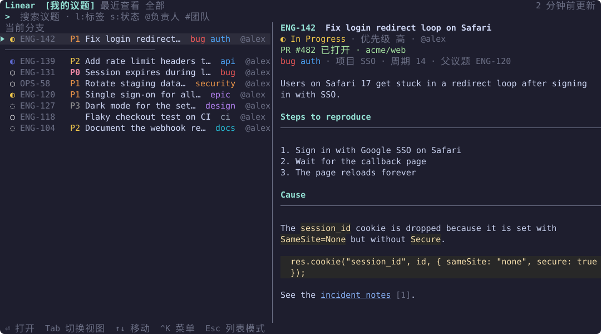
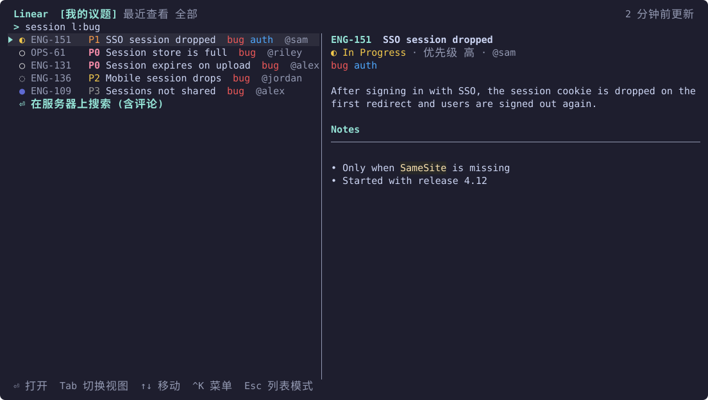
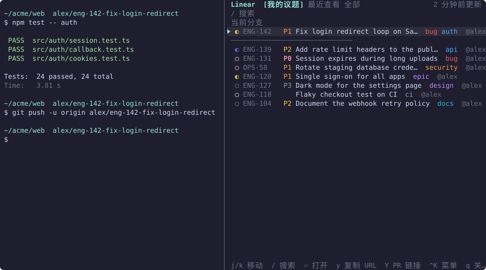
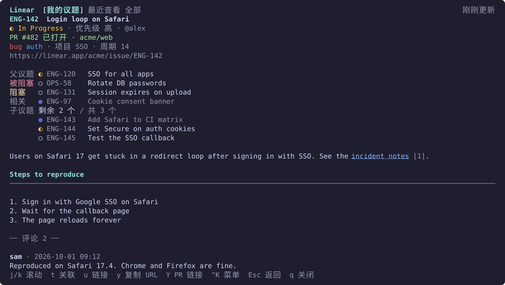
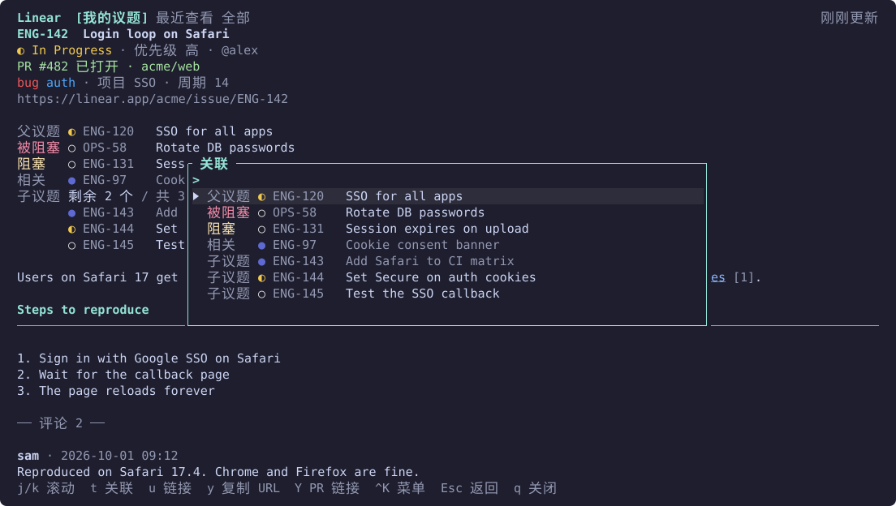
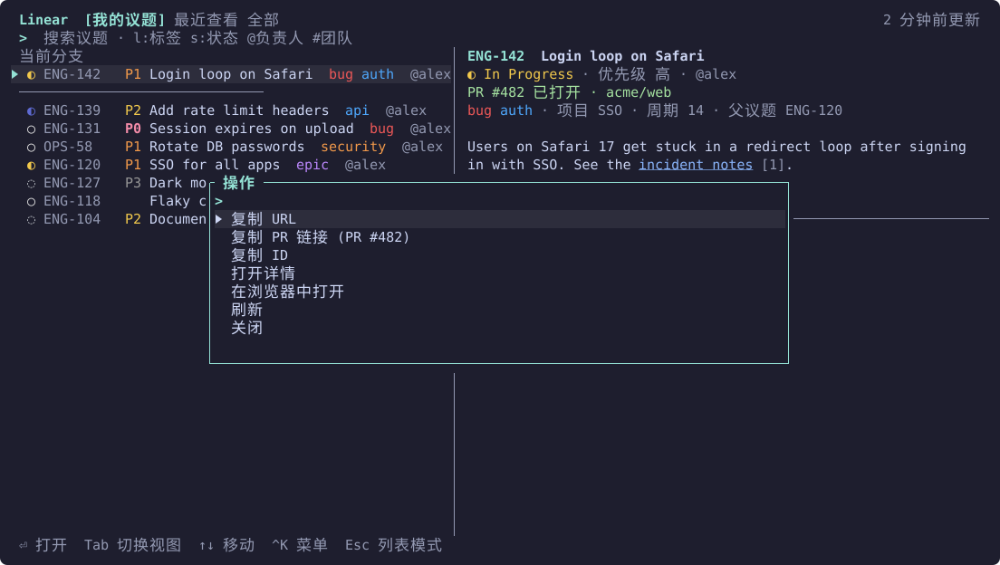
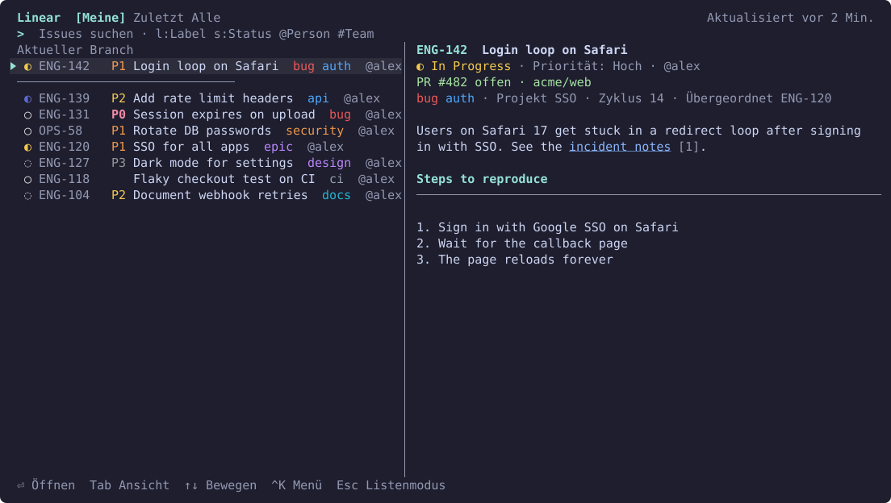

# herdr-linear

**在 [herdr](https://herdr.dev) 中快速查询 Linear 议题。** 一个弹出式面板，或一个可以一直开着的侧边窗格，边输入边搜索，在终端中把议题正文和评论渲染为 Markdown，并能复制议题和 PR 链接。

[English](../README.md) · [한국어](README.ko.md) · [日本語](README.ja.md) · 简体中文 · [Deutsch](README.de.md)

[路线图](../ROADMAP.md) · MIT

> 本 README 译自英文版。如有出入，以英文版为准。



## 功能

### 面板

按键打开后直接输入即可。共有三个标签页：我的未完成议题 · 最近查看 · 所在团队的全部议题。状态和标签按 Linear 中设置的颜色显示。

- **优先级**：议题 ID 后面带有优先级标识，按紧急程度从高到低：红色 `P0` 紧急，橙色 `P1` 高，黄色 `P2` 中，灰色 `P3` 低。搜索标记 `p:` 仍然接受 Linear 的数字或名称 (`p:1` 或 `p:urgent` 即 P0)。
- **当前分支**：当焦点窗格位于形如 `me/eng-123-fix-login` 的分支时，该议题会置顶。
- **预览**：窗口宽度不少于 100 列时，右侧会预览所选议题。

### 边输入边搜索

已缓存的议题会即时搜索。停顿 300 毫秒后，也会搜索服务器并合并结果。可以把自由文本与 `l:bug`、`s:todo`、`@me`、`#ENG`、`p:urgent` 等标记组合使用 (见[搜索语法](#搜索语法))。选择列表底部的“⏎ 在服务器上搜索 (含评论)”，可以连评论一起搜索。



### 侧边窗格

用第二个按键在工作窗格的右侧打开同样的界面，再按一次即可关闭。它会一直开着，默认每 60 秒刷新你正在查看的内容。在列表模式下，Esc 不会关闭它，按 `q` 才会。



### 议题详情

详情页显示 Markdown 正文 (标题、列表、代码块、表格)、评论和链接列表 (`u`)。打开的 PR 显示在最上方，父议题、子议题、被阻塞、阻塞和相关议题按 Linear 的状态色显示。



### 关联议题

按 `t` 打开关联议题菜单，或点击关联议题所在的行，即可打开该议题。按 Esc 回到原来的位置。



### 操作与复制

Ctrl+K 打开操作菜单，输入文字可以筛选菜单项。在列表和详情模式下，`y` 复制议题 URL，`Y` 复制打开的 PR 链接。复制使用 OSC 52，因此即使通过远程连接 herdr，内容也会进入你本机的剪贴板。



### 更多

- **链接**：在 herdr 中 Ctrl+点击 `linear.app/…/issue/…` 链接，即可在面板中打开。选中议题 ID 后再打开面板，会直接跳转到该议题。
- **鼠标**：滚轮移动和滚动，点击选择，再次点击已选中的行即可打开。可以点击的地方，鼠标指针移上去时会高亮。
- **缓存优先**：看过的议题会保存在本地，下次立即显示，并在后台刷新。离线时仍然可读。

### 语言

默认为英语。设置 `language` 可以把界面切换为韩语、日语、简体中文或德语 (见[配置](#配置))。

<table>
  <tr>
    <td><a href="../README.md"></a><br>English</td>
    <td><a href="README.ko.md"></a><br>한국어</td>
  </tr>
  <tr>
    <td><a href="README.ja.md"></a><br>日本語</td>
    <td><a href="README.de.md"></a><br>Deutsch</td>
  </tr>
</table>

## 环境要求

- herdr 0.9.3 或更高版本
- macOS (Apple Silicon 或 Intel) 或 Linux (x86_64 或 arm64)，需要 `bash` 和 `curl` (macOS 和大多数 Linux 发行版已预装)
- Rust 1.88 或更高版本，仅在无法使用预编译二进制文件时才需要 (其他平台，或下载失败)。此时会从源码构建插件。

## 安装

```sh
herdr plugin install jenthous/herdr-linear
```

在 macOS 和 Linux 上，会从 GitHub Releases 下载预编译的二进制文件，并校验其 SHA-256 校验和。如果无法完成下载或校验，则用 Cargo 从源码构建。

插件无法自行注册按键。请在 `~/.config/herdr/config.toml` 中添加按键绑定：

```toml
[[keys.command]]
key = "prefix+i"
type = "plugin_action"
command = "jh.linear.palette"
description = "Linear search"

[[keys.command]]
key = "prefix+shift+i"
type = "plugin_action"
command = "jh.linear.side"
description = "Linear side pane"

# 可选：使用非拉丁字符输入法时也能生效的直接按键
[[keys.command]]
key = "ctrl+alt+i"
type = "plugin_action"
command = "jh.linear.palette"
description = "Linear search"
```

可以用同样的方法为 `jh.linear.side` 设置直接按键。这些操作也会出现在 command-palette 插件中。

## API 密钥

在 Linear → Settings → Security & access → Personal API keys 中创建密钥。第一次打开面板时会要求输入密钥：粘贴后按 Enter。密钥会先向 Linear 验证，然后以 0600 权限保存。

- 如果设置了环境变量 `LINEAR_API_KEY`，则优先使用它。
- 密钥只会放在 `Authorization` 请求头中发送。它不会被写入日志、显示在屏幕上，也不会出现在错误信息里。

## 按键

| 模式 | 按键 |
|---|---|
| 搜索 (默认) | 输入即搜索，↑/↓ 或 Ctrl+P/N 移动，Enter 打开，Tab/Shift+Tab 切换标签页，Ctrl+K 打开操作菜单，Esc 进入列表模式 |
| 列表 | j/k 移动，g/G 跳到顶部/底部，`/` 搜索，Enter 打开，`y` 复制议题 URL，`Y` 复制打开的 PR 链接，`r` 刷新，`o` 在浏览器中打开，`q`/Esc 关闭 (Esc 不会关闭侧边窗格) |
| 详情 | j/k 滚动，Ctrl+D/U 翻半页，g/G 跳到顶部/底部，`t` 查看关联议题，`u` 查看链接，`y` `Y` `o` `r`，Esc 返回，`q` 关闭 |

- 议题 ID 可以在 Ctrl+K 菜单中复制。复制 URL 位于该菜单的最上方。
- Ctrl 组合键在任何输入法下都有效。在列表和详情模式下，韩文字母 (Jamo) 键等同于对应的拉丁字母键 (ㅓ→j，ㅏ→k，…)。
- 开启鼠标支持时，要在面板内拖选文字，需要按住 Shift (或 Option，取决于终端)。
- 通过远程连接 herdr 时，`o` 会在运行 herdr 的那台机器上打开浏览器。

## 搜索语法

可以混用自由文本和标记。所有条件都必须满足。含空格的值要加引号 (`s:"In Progress"`)。

| 标记 | 含义 | 示例 |
|---|---|---|
| `s:值` | 状态名称或类型 (`started`、`todo`、`done` 等) | `s:started` |
| `l:值` | 标签 | `l:bug` |
| `@值` | 负责人 (`@me` 表示你自己) | `@minsu` |
| `#KEY` | 团队 | `#ENG` |
| `p:值` | 优先级 (`urgent`/`1` … `none`/`0`) | `p:high` |

## 配置

`~/.config/herdr/plugins/config/jh.linear/config.toml`。所有配置项都是可选的。

```toml
language = "zh-CN"       # 界面语言：en、ko、ja、zh-CN、de (默认：en)
teams = ["ENG", "OPS"]   # 搜索和“全部”标签页的范围；留空表示你所在的全部团队

[side]
refresh_seconds = 60     # 侧边窗格的刷新间隔 (0 到 3600 秒)；0 表示关闭

[cache]
retention_days = 30      # 超过这么多天既没有获取也没有查看过的议题，会从缓存中清除
```

语言设置会在下次启动面板、侧边窗格或 CLI 时生效。请把 `language` 放在文件开头、所有 `[section]` 之前 (TOML 会把写在 `[section]` 下面的键归入该 `[section]`，放在下面就不会生效)。`de-DE`、`ja_JP` 这样的地区标签也可以使用。独立运行的 CLI 读取它自己的配置文件 `~/.config/herdr-linear/config.toml`；如果两者都用，请在那里也设置 `language`。herdr 命令面板中显示的操作名称来自插件清单 (manifest)，因此保持为英文。

## 文件

| 文件 | 位置 |
|---|---|
| `config.toml`、`credentials` | `~/.config/herdr/plugins/config/jh.linear/` |
| `cache.db`、`herdr-linear.log`、`side-panes.json` | `~/.local/state/herdr/plugins/jh.linear/` |

独立运行的 CLI 使用 `~/.config/herdr-linear/` 和 `~/.local/state/herdr-linear/`。两边也能找到对方保存的密钥。

## CLI

同一个二进制文件也可以单独使用：

```sh
herdr-linear login | logout | whoami
herdr-linear mine
herdr-linear search login l:bug @me
herdr-linear search --deep session expired
herdr-linear show ENG-123
```

## 故障排查

- **面板打不开**：herdr 在设置、复制模式或其他模态窗口打开时会拒绝弹出面板。关闭它们后再试。
- **侧边窗格无法打开或关闭**：原因会显示在 herdr 通知和 `herdr-linear.log` 中。如果侧边窗格是以其他方式关闭的，按键会重新打开一个。
- **“离线”**：显示已缓存的数据，下次查询时会重试。
- **“已达到 Linear API 速率限制”**：底部会短暂显示一条提示，告知何时可以重试。在此之前自动服务器搜索会暂停，本地搜索仍可使用。
- 错误会写入 `herdr-linear.log`。

## 开发

```sh
cargo test
cargo clippy --all-targets -- -D warnings
scripts/deploy-local.sh   # 在本机构建并链接一份稳定的副本，供日常使用
```

`scripts/deploy-local.sh` 会把构建好的插件复制到 `~/.local/share/herdr-linear/plugin`，将其链接到 herdr，并把 `herdr-linear` 命令链接到 `~/.local/bin`。此后在仓库中开发，不会影响你日常使用的插件。

要重新生成截图，运行 `cargo run --example screenshots`。截图由模拟数据绘制，并写入 `docs/images/<language>/`。

发布时，递增 `Cargo.toml` 和 `herdr-plugin.toml` 中的 `version`，运行 `cargo test` 让 Cargo 更新 `Cargo.lock`，提交，并先推送标签 `vX.Y.Z`。发布工作流附上二进制文件和校验和之后，再推送 `main`。

## 许可证

MIT。参见 [LICENSE](../LICENSE)。
